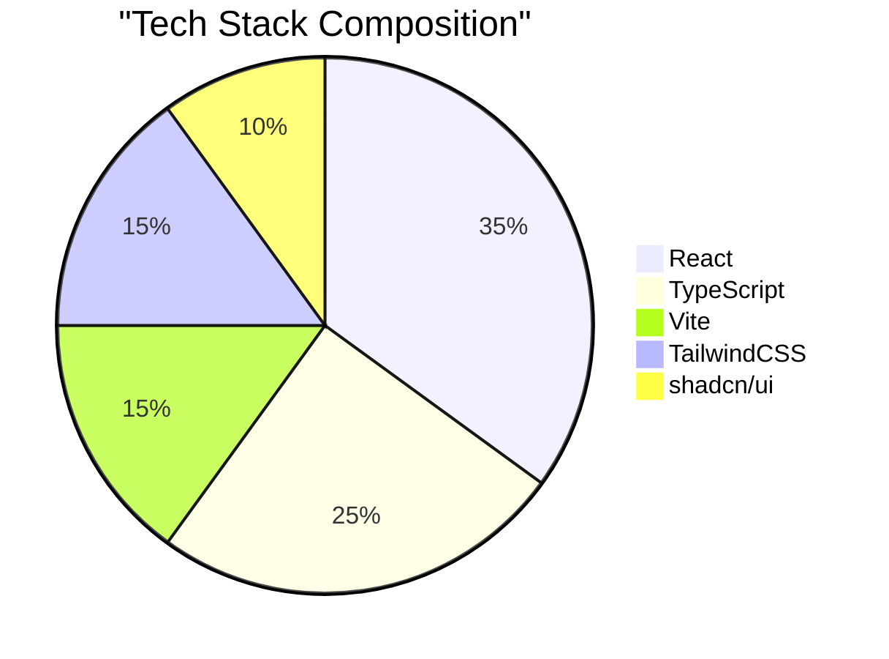
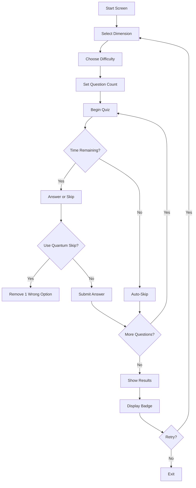

# 🚀⚡ QUANTUM QUEST: The Ultimate Knowledge Dimension ⚡🚀

> 🌌 _"Not just a quiz... it's a multidimensional challenge of wits and speed across the knowledge continuum."_

[](https://opensource.org/licenses/MIT)
[](https://vitejs.dev/)
[](https://github.com/yourusername/quantum-quest)
[](https://github.com/yourusername/quantum-quest)

<div align="center">
  
</div>

## 🌠 Overview

**Quantum Quest** is a high-intensity, strategically deep quiz experience that challenges your knowledge across multiple dimensions of learning. Unlike traditional quiz apps, Quantum Quest integrates time pressure, strategic decision-making, and adaptive difficulty to create an experience that's as engaging as it is educational.

With **5 distinct knowledge dimensions**, **3 increasing difficulty levels**, and a **massive question pool of 450+ expertly crafted challenges**, this isn't just about what you know—it's about how you perform under pressure.

## 💫 Key Features

| Feature                            | Description                                                                                         |
| ---------------------------------- | --------------------------------------------------------------------------------------------------- |
| 🪐 **Dimension Selection**         | Explore **5 unique knowledge dimensions** - Science, History, Arts, Technology, and Logic           |
| ⚡ **Progressive Difficulty**      | Challenge yourself with `Novice`, `Adept`, or `Quantum Master` levels                               |
| 🔢 **Customizable Experience**     | Configure quiz length (10-30 questions) to fit your schedule                                        |
| 💣 **Quantum Skip Technology**     | Utilize 3 strategic "Quantum Skips" per quiz to eliminate one wrong option                          |
| ⏳ **Adaptive Timing System**      | Beat the clock with difficulty-based timers: `Novice: 30s` \| `Adept: 20s` \| `Quantum Master: 15s` |
| 🎯 **Extensive Question Database** | Access 30 unique questions per topic/difficulty combination (450+ total)                            |
| 📊 **Performance Analytics**       | Review comprehensive post-quiz analysis with correct solutions                                      |
| 🏅 **Achievement System**          | Earn performance badges based on accuracy, speed, and skill                                         |
| 🔄 **Infinite Replayability**      | Experience new question combinations with each attempt                                              |

## 🧠 Knowledge Dimensions

- **🔬 Scientific Spectrum** - From fundamental physics to cutting-edge discoveries
- **📜 Historical Continuum** - Ancient civilizations through modern developments
- **🎭 Artistic Expression** - Literature, visual arts, music, and cultural movements
- **💻 Technological Innovation** - Computer science, engineering, and digital revolution
- **🧩 Logical Reasoning** - Problem-solving, patterns, and analytical challenges

## ⚙️ Technical Architecture



## 🌀 User Journey



## 🚀 Getting Started

### Prerequisites

- Node.js (v16+)
- npm or yarn

### Installation

```bash
# Clone the repository
git clone https://github.com/yourusername/quantum-quest.git
cd quantum-quest

# Install dependencies
npm install
# OR
yarn install

# Start the development server
npm run dev
# OR
yarn dev
```

### Production Build

```bash
# Create optimized production build
npm run build
# OR
yarn build

# Preview production build locally
npm run preview
# OR
yarn preview
```

## 🧪 Testing

```bash
# Run test suite
npm run test
# OR
yarn test

# Run tests with coverage
npm run test:coverage
# OR
yarn test:coverage
```

## 🤝 Contributing

Contributions are welcome! Please feel free to submit a Pull Request.

1. Fork the repository
2. Create your feature branch (`git checkout -b feature/amazing-feature`)
3. Commit your changes (`git commit -m 'Add some amazing feature'`)
4. Push to the branch (`git push origin feature/amazing-feature`)
5. Open a Pull Request

## 📄 License

This project is licensed under the MIT License - see the LICENSE file for details.

<div align="center">
  <h3>⚡ Side Effects May Include</h3>
  <p>• Enhanced cognitive function • Improved reaction time • Addiction to knowledge acquisition</p>
  
</div>
